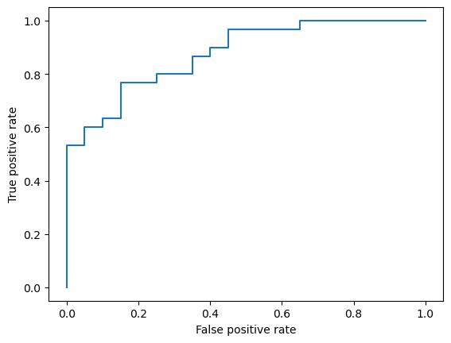
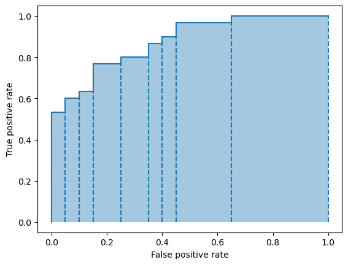
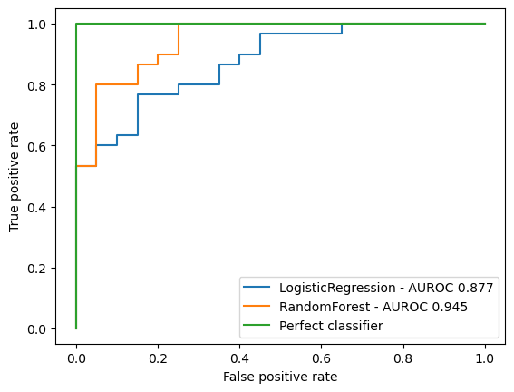

## Classification 
Basically, given a set of features X and an output Y, we want to be able to create a hypothesis $\hat{y}$ such that it allows us to predict/regress Y on X. 

## What I'll cover in this cheatsheet:
- Making dummy dataset 
- Confusion Matrix
- Model Threshold
- Logistic Regression
- Threshold and Receiver Operating Characteristics (ROC)
- Area under curve
- Comparing ROC
- AUROC 

## Dummy dataset
`from sklearn.datasets import make_classification` - generate n-class classification problem 

If you want to create 50 samples with 20 features each (default), and 2 classes, with 40:60 proportion of samples assigned to each class, you do the following: 

```
x, y = make_classification(
    n_classes = 2,
    class_sep = 0.1, 
    n_samples = 50, 
    weights = [0.4, 0.6]
    random_state = 42
)

x: 

array([[-0.92693047,  0.86333899, -0.37618535,  0.44381943, -1.24778318,
        -1.02438764,  0.01023306, -0.52821322, -0.05952536,  1.16316375,
         1.44127329,  1.12371669, -3.24126734,  1.6324113 , -0.25256815,
         0.13074058,  0.77463405, -0.44004449, -1.43014138, -1.43586215],
       [-0.45006547, -0.76955332,  0.34074761,  0.0052437 ,  0.51443883,
        -0.14237949,  0.11567463,  0.69281321,  0.62284993,  1.55115198,

y: 

([0, 1, 0, 0, 1, 1, 0, 0, 0, 1, 1, 1, 0, 0, 1, 0, 0, 1, 1, 1, 1, 0,
0, 0, 1, 1, 1, 0, 0, 1, 1, 1, 1, 1, 1, 0, 1, 1, 0, 0, 1, 1, 1, 1,
1, 1, 0, 0, 1, 1])
```

- `class_sep` is a factor determining how spread out the classes are (larger the value, more spread out and easier the classification task is)  

## Making a random prediction 
- when using confusion matrix, you need to have y_pred (y_hat) values. So here we can generate a random prediction. 

`y_pred = np.random.choice([0, 1], size=(50))` 

```
([0, 1, 0, 0, 0, 1, 0, 0, 0, 1, 0, 0, 0, 0, 1, 0, 1, 1, 1, 0, 1, 0,
1, 1, 1, 1, 1, 1, 1, 1, 0, 0, 1, 1, 1, 0, 1, 0, 0, 0, 0, 0, 1, 1,
1, 1, 1, 0, 1, 1])
```

## Confusion matrix
`from sklearn.metrics import confusion_matrix`

`c = confusion_matrix(y, y_pred)`

```
c:
array([[14,  6],
       [ 9, 21]])
```

`tn, fp, fn, tp = c.ravel()`

`tpr = tp/(tp+fn)` - sensitivity/recall

`fpr = fp/(fp+tn)` - specificity

## Predict and predict_proba
`from sklearn.linear_model import LogisticRegression`

`model = LogisticRegression()`

`model.fit(x, y)` - takes the input data, and finds the line of best fit (Y_hat)

`y_score = model.predict_proba(x)[:, 1]` - takes the features, and outputs the probability that it'll lie in a certain class. e.g. if 2 classes, it's an array if [P_classA, P_classB] e.g. [0.90, 0.1]. In this case, array slicing you only take the second probability

`model.predict(x)` - gives the class with max probability

```
Output: 
[0, 1, 0, 1]
```

## Receiver Operating Characteristic (ROC)
ROC curves are used in binary classificatin to evaluate *which threshold to use*. The idea is pretty simple: at any threshold, you'll get a TPR and a FPR. High TPR is good, high FPR is bad. 

`from sklearn.metrics import roc_curve` 

`fpr, tpr, thresholds = roc_corve(y, y_score)` - the inputs are the true labels, and predicted labels . It gives you three arrays -> the fpr and tpr at each threshold level. 

```
fpr:

([0.  , 0.  , 0.  , 0.05, 0.05, 0.1 , 0.1 , 0.15, 0.15, 0.25, 0.25,
0.35, 0.35, 0.4 , 0.4 , 0.45, 0.45, 0.65, 0.65, 1.  ])

tpr: 

[0.        , 0.03333333, 0.53333333, 0.53333333, 0.6       ,
0.6       , 0.63333333, 0.63333333, 0.76666667, 0.76666667,
0.8       , 0.8       , 0.86666667, 0.86666667, 0.9       ,
0.9       , 0.96666667, 0.96666667, 1.        , 1.        ]

thresholds:
([       inf, 0.98636375, 0.82630293, 0.81265146, 0.7726144 ,
0.68654469, 0.68422306, 0.673924  , 0.5860542 , 0.55131201,
0.54585791, 0.48958986, 0.45714643, 0.45041507, 0.44545387,
0.42399544, 0.40709979, 0.32173289, 0.31749714, 0.04615457])
```

`roc_df = pd.DataFrame( zip(fpr, tpr, thresholds), columns = ["FPR", "TPR", "Threshold"])` - converting those into a dataframe 

```
FPR	TPR	Threshold
0	0.00	0.000000	inf
1	0.00	0.033333	0.986364
2	0.00	0.533333	0.826303
3	0.05	0.533333	0.812651
4	0.05	0.600000	0.772614
```

Creating the ROC plot 
```
fig, ax = plt.subplots()

ax.plot( fpr, tpr )

ax.set_xlabel( 'False positive rate' )
ax.set_ylabel( 'True positive rate' )

plt.show()
```


## Area under the Curve (AUROC)

`from sklearn.metrics import roc_auc_score`

`auroc = roc_auc_score(y, y_score)` -> output: 0.867

Drawing the ROC curve plot: 
```
fig, ax = plt.subplots()
ax.plot(fpr, tpr)
ax.fill_between( fpr, tpr, step="pre", alpha=0.4 )
ax.set_xlabel( 'False positive rate' )
ax.set_ylabel( 'True positive rate' )
# Project points to x-axis
plt.vlines( fpr, 0, tpr, linestyle="dashed" )
plt.show()
```


Note: each hypothesis (y_hat) gives us a distinct ROC. 

It allows us to compare different classifiers. The classifier with high ROC is better!

## Random Forest Classifier 

`from sklearn.ensemble import RandomForestClassifier`

`rf = RandomForestClassifier(max_depth=1)`

`rf.fit(x, y)`

`y_score_rf = rf.predict_proba(x)[:, 1]`

`fpr_rf, tpr_rf, thresholds_rf = roc_curve(y, y_score_rf)`

`auroc_rf = roc_auc_score(y, y_score_rf)`

Plotting several AUROC to compare:

```
fig, ax = plt.subplots()

# Logistic Regression
ax.plot( fpr, tpr )

# Random Forest
ax.plot( fpr_rf, tpr_rf )

# Perfect Classifier
ax.plot([0, 0, 1], [0, 1, 1])

ax.set_xlabel( 'False positive rate' )
ax.set_ylabel( 'True positive rate' )
ax.legend(
    [
        'LogisticRegression - AUROC {:.3f}'.format(auroc),
        'RandomForest - AUROC {:.3f}'.format(auroc_rf),
        'Perfect classifier'
    ]
)

plt.show()

```

We can see RandomForest is better!


And then finally there's the bits on multi-class classifiers which I'll get to next time:


```
from sklearn import svm, datasets
from sklearn.preprocessing import label_binarize
from sklearn.model_selection import train_test_split
from sklearn.multiclass import OneVsRestClassifier

iris = datasets.load_iris()
X = iris.data
y = iris.target

# Binarize the output
y = label_binarize(y, classes=[0, 1, 2])
n_classes = y.shape[1]

X_train, X_test, y_train, y_test = train_test_split( X, y, test_size=0.5, random_state=0 )

random_state = np.random.RandomState(0)

classifier = OneVsRestClassifier(
    svm.SVC( kernel="linear", probability=True, random_state=random_state )
)
y_score = classifier.fit( X_train, y_train ).decision_function( X_test )

y_prob = classifier.predict_proba( X_test )

macro_roc_auc_ovo = roc_auc_score( y_test, y_prob, multi_class="ovo", average="macro" )
weighted_roc_auc_ovo = roc_auc_score( y_test, y_prob, multi_class="ovo", average="weighted" )
print(
    "One-vs-One ROC AUC scores:\n{:.6f} (macro),\n{:.6f} "
    "(weighted by prevalence)".format(macro_roc_auc_ovo, weighted_roc_auc_ovo)
)

macro_roc_auc_ovr = roc_auc_score( y_test, y_prob, multi_class="ovr", average="macro" )
weighted_roc_auc_ovr = roc_auc_score( y_test, y_prob, multi_class="ovr", average="weighted" )
print(
    "One-vs-Rest ROC AUC scores:\n{:.6f} (macro),\n{:.6f} "
    "(weighted by prevalence)".format(macro_roc_auc_ovr, weighted_roc_auc_ovr)
)
```