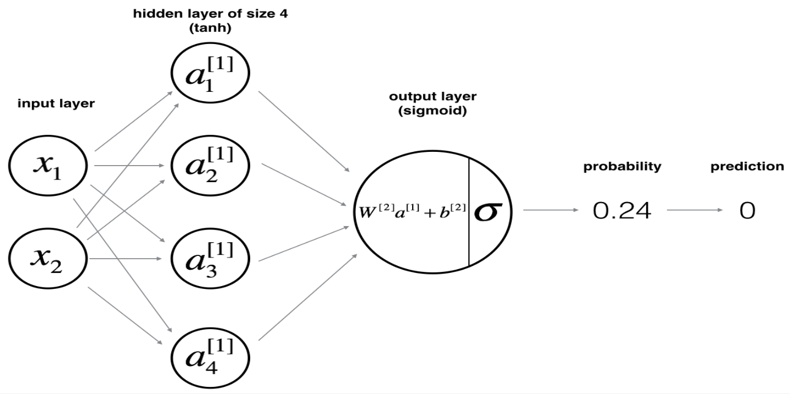
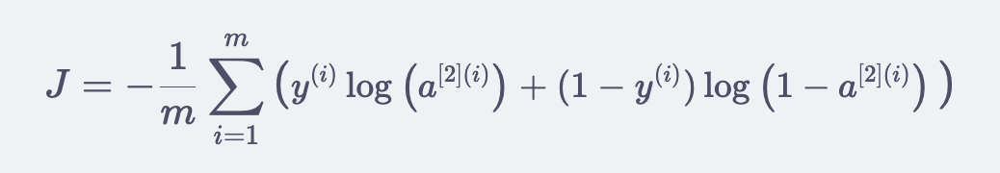

# Some useful code snippets for building shallow neural nets (1 hidden layer)


## High Level Overview:
Idea is to 'train' a function (and params), and use the function to do prediction. You can think of the function also as the model. Pass in data into the model, get output. 
```python
# NN_model
def nn_model(X, Y, n_h, learning_rate, num_iterations = 10000, print_cost=False):
    n_x = layer_sizes(X, Y)[0]
    n_y = layer_sizes(X, Y)[2]
    
    # Initialize parameters
    parameters = initialize_parameters(n_x, n_h, n_y)
    W1 = parameters["W1"]
    b1 = parameters["b1"]
    W2 = parameters["W2"]
    b2 = parameters["b2"]
    
    # Loop (gradient descent)
    for i in range(0, num_iterations):
        # Forward propagation. Inputs: "X, parameters". Outputs: "A2, cache"
        A2, cache = forward_propagation(X, parameters)
        # Cost function. Inputs: "A2, Y, parameters". Outputs: "cost"
        cost = compute_cost(A2, Y, parameters)
        # Backpropagation. Inputs: "parameters, cache, X, Y". Outputs: "grads"
        grads = backward_propagation(parameters, cache, X, Y)
        # Update rule for each parameter
        parameters = update_parameters(parameters, grads, learning_rate)
        # If print_cost=True, Print the cost every 1000 iterations
        if print_cost and i % 1000 == 0:
            print ("Cost after iteration %i: %f" %(i, cost))
    # Returns parameters learnt by the model. They can then be used to predict output
    return parameters

X_train, Y_train = nn_model_test_case()
parameters = nn_model(X_train, Y_train, 4, 1.02,num_iterations=10000, print_cost=True)
predictions = predict(parameters, X_test)
```


## Individual Functions

### Initialize Params (variable number of input, hidden, and output layers)
```python
def initialize_parameters(n_x, n_h, n_y):
    """
    Argument:
    n_x -- size of the input layer
    n_h -- size of the hidden layer
    n_y -- size of the output layer
    
    Returns:
    params -- python dictionary containing your parameters:
                    W1 -- weight matrix of shape (n_h, n_x)
                    b1 -- bias vector of shape (n_h, 1)
                    W2 -- weight matrix of shape (n_y, n_h)
                    b2 -- bias vector of shape (n_y, 1)
    """
    
    np.random.seed(2) 

    W1 = np.random.randn(n_h, n_x)
    b1 = np.random.randn(n_h, 1)
    W2 = np.random.randn(n_y, n_h)
    b2 = np.random.randn(n_y, 1)
    
    assert (W1.shape == (n_h, n_x))
    assert (b1.shape == (n_h, 1))
    assert (W2.shape == (n_y, n_h))
    assert (b2.shape == (n_y, 1))
    
    parameters = {"W1": W1,
                  "b1": b1,
                  "W2": W2,
                  "b2": b2}
    
    return parameters
```

### Forward Prop

```python
# GRADED FUNCTION: forward_propagation
from operator import itemgetter
def forward_propagation(X, parameters):
    """
    Argument:
    X -- input data of size (n_x, m)
    parameters -- python dictionary containing your parameters (output of initialization function)
    
    Returns:
    A2 -- The sigmoid output of the second activation
    cache -- a dictionary containing "Z1", "A1", "Z2" and "A2"
    """

    W1, W2, b1, b2 = itemgetter("W1", "W2", "b1", "b2")(parameters)

    Z1 = W1@X + b1 # (4, 2)@(2, 400) = (4, 400)
    A1 = np.tanh(Z1) #(4, 400)
    Z2 = W2@A1 + b2 # (1, 4)@(4, 400) = (1, 400)
    A2 = sigmoid(Z2) # (1, 400)
    
    assert(A2.shape == (1, X.shape[1]))
    
    # Values needed in the backpropagation are stored in "cache". This will be given as an input to the backpropagation
    cache = {"Z1": Z1,
             "A1": A1,
             "Z2": Z2,
             "A2": A2}
    
    return A2, cache
```

### Compute Cost

```python
def compute_cost(A2, Y):
    """
    Computes the cross-entropy cost given in equation (13)
    
    Arguments:
    A2 -- The sigmoid output of the second activation, of shape (1, number of examples)
    Y -- "true" labels vector of shape (1, number of examples)

    Returns:
    cost -- cross-entropy cost given equation (13)
    
    """
    m = Y.shape[1] # number of example
    cost = -(1/m) * ((Y@np.log(A2.T)) + (1-Y)@(np.log(1 - A2.T)))
    cost = float(np.squeeze(cost))  # makes sure cost is the dimension we expect.# E.g., turns [[17]] into 17  
    assert(isinstance(cost, float))
    return cost
```

### Back Prop

```python
# GRADED FUNCTION: backward_propagation
from operator import itemgetter

def backward_propagation(parameters, cache, X, Y):
    """
    Arguments:
    parameters -- python dictionary containing our parameters 
    cache -- a dictionary containing "Z1", "A1", "Z2" and "A2".
    X -- input data of shape (2, number of examples)
    Y -- "true" labels vector of shape (1, number of examples)
    
    Returns:
    grads -- python dictionary containing your gradients with respect to different parameters
    """
    m = X.shape[1]
    
    W1, W2, b1, b2 = itemgetter("W1", "W2", "b1", "b2")(parameters)
    Z1, A1, Z2, A2 = itemgetter("Z1", "A1", "Z2", "A2")(cache)
    # Backward propagation: calculate dW1, db1, dW2, db2. 
    dZ2 = A2 - Y # (1, 400)
    dW2 = (1/m) * dZ2@A1.T #(1, 400)@(400, 4) = (1, 4)
    db2 = (1/m) * np.sum(dZ2, axis=1, keepdims=True) # (1, 1)
    dZ1 = (W2.T@dZ2) * (1 - np.power(A1, 2)) # (4, 1)@(1, 400) = (4, 400) | * | (4, 400)
    dW1 = (1/m) * dZ1@X.T # (4, 400)@(400, 2) = (4, 2)
    db1 = (1/m) * np.sum(dZ1, axis=1, keepdims=True) #(4, 1)
    
    grads = {"dW1": dW1,
             "db1": db1,
             "dW2": dW2,
             "db2": db2}
    
    return grads
```

### Update Params

```python
# GRADED FUNCTION: update_parameters

def update_parameters(parameters, grads, learning_rate):
    """
    Updates parameters using the gradient descent update rule given above
    
    Arguments:
    parameters -- python dictionary containing your parameters 
    grads -- python dictionary containing your gradients 
    
    Returns:
    parameters -- python dictionary containing your updated parameters 
    """

    W1, W2, b1, b2 = itemgetter("W1", "W2", "b1", "b2")(parameters)

    dW1, dW2, db1, db2 = itemgetter("dW1", "dW2", "db1", "db2")(grads)

    W1 -= learning_rate*dW1
    W2 -= learning_rate*dW2
    b1 -= learning_rate*db1
    b2 -= learning_rate*db2
    parameters = {"W1": W1,
                  "b1": b1,
                  "W2": W2,
                  "b2": b2}
    
    return parameters
```

### Training

```python
X_train, Y_train = nn_model_test_case()
parameters = nn_model(X_train, Y_train, 4, 1.02,num_iterations=10000, print_cost=True)
```

### Prediction

```python
def predict(parameters, X):
    predictions, cache = forward_propagation(X, parameters)
    return predictions

predictions = predict(parameters, X_test)
```

