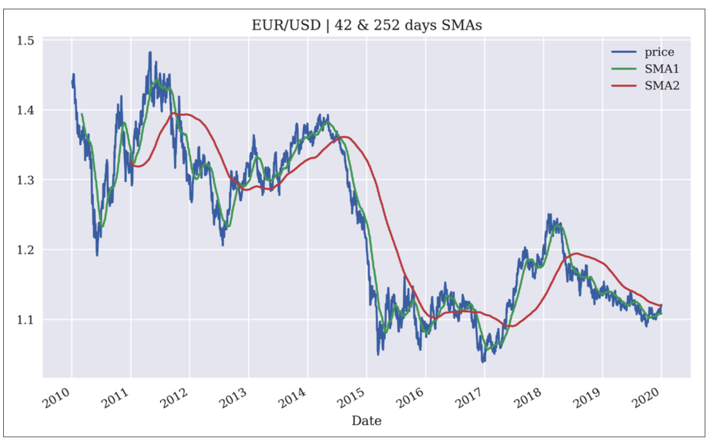
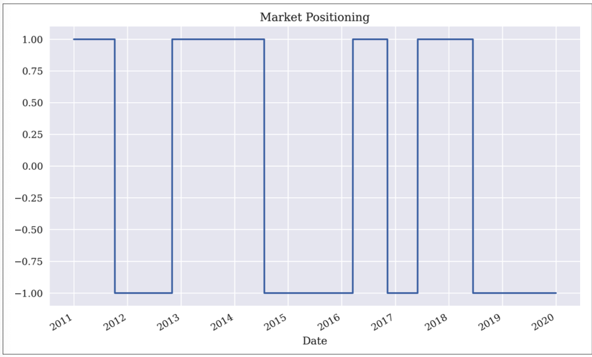
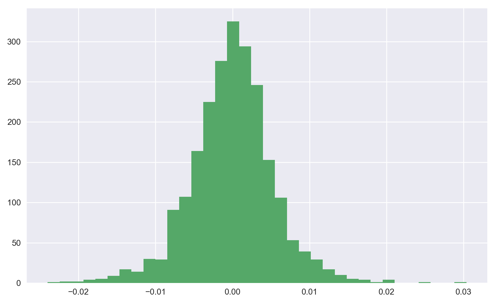
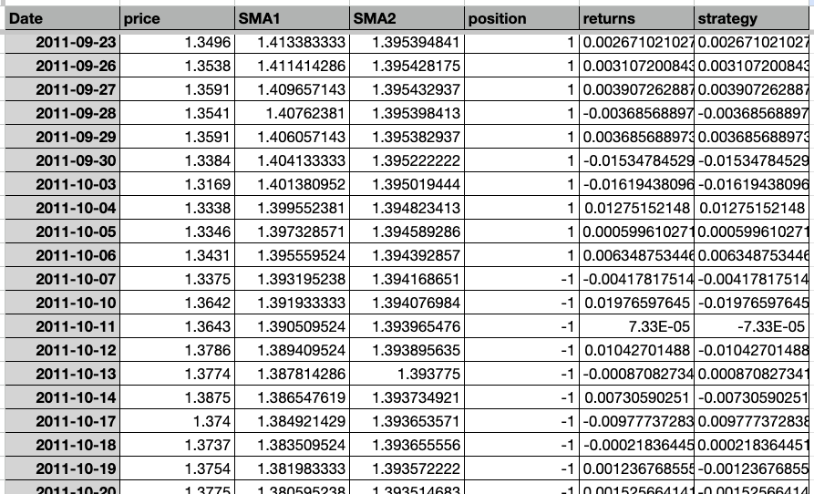
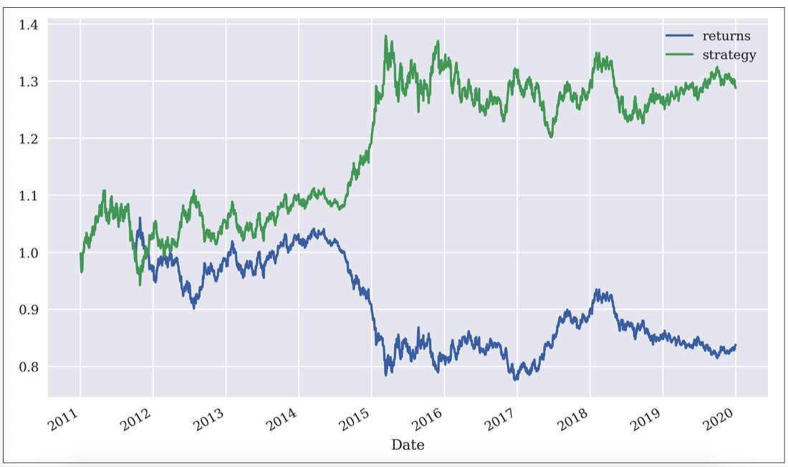
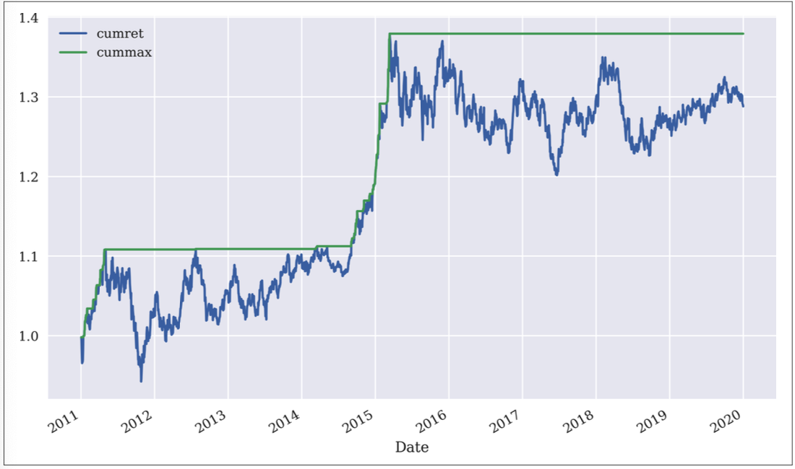

### Implementing a SMA based rule
Assuming that your starting point is a dataframe of daily prices, you can easily derive 42-day and 252-day SMA with the following: 

`raw = pd.read_csv('http://hilpisch.com/pyalgo_eikon_eod_data.csv',index_col=0, parse_dates=True).dropna()`

`data = pd.DataFrame(...price data)` - creating df

`data['SMA1'] = data['price'].rolling(42).mean()` - create 42 SMA column

`data['SMA2'] = data['price'].rolling(252).mean()` - create 252 SMA column


```
In [44]: data.tail()
Out[44]: price SMA1 SMA2
Date
2019-12-24 1.1087 1.107698 1.119630
2019-12-26 1.1096 1.107740 1.119529
2019-12-27 1.1175 1.107924 1.119428
2019-12-30 1.1197 1.108131 1.119333
2019-12-31 1.1210 1.108279 1.119231
```

You can generate the SMA chart like so:

`data.plot(title='EUR/USD | 42 & 252 days SMAs',figsize=(10, 6))` - generate a chart (need to import mpl n pyplot first)



If your rule is, go long  whenever the shorter SMA is above the longer one and vice versa, we can implement the logic by creating a new 'position' column represented by 1 and -1 (1 is long)

`data['position'] = np.where(data['SMA1'] > data['SMA2'],1,-1)` - create new 'position' column, which looks like this:

```
In [90]: data.head(10)
Out[90]: 
             price      SMA1      SMA2  position
Date                                            
2010-12-31  1.3377  1.342579  1.326218         1
2011-01-03  1.3351  1.340945  1.325798         1
2011-01-04  1.3301  1.338940  1.325374         1
2011-01-05  1.3151  1.336448  1.324874         1
```

`data['position'].plot(ylim=[-1.1, 1.1],title='Market Positioning',figsize=(10, 6))` -  plotting your entry



### Calculating performance of strategy
`data['returns'] = np.log(data['price'] / data['price'].shift(1))` - calculates log returns

`data['price'].shift(1)` - shifts rows down by one. 

`data['price'] / data['price'].shift(1)` - essentially means, today's price/ytd's price. This gives %change. You end up with sth like: 

```
In [109]: data['price']/data['price'].shift(1)
Out[109]: 
Date
2010-12-31         NaN
2011-01-03    0.998056
2011-01-04    0.996255
2011-01-05    0.988723
2011-01-06    0.988594
2011-01-06    0.988594
                ...   
2019-12-24    1.000090
2019-12-26    1.000812
```
If price dropped relative to ytd, this value will be less than 1. If it rose, it'll be more than 1. 

By logging it, you get:

```
In [110]: np.log(data['price']/data['price'].shift(1))
Out[110]: 
Date
2010-12-31         NaN
2011-01-03   -0.001946
2011-01-04   -0.003752
2011-01-05   -0.011341
2011-01-06   -0.011472
                ...   
2019-12-24    0.000090
2019-12-26    0.000811
```

The effect of logging returns is that if price dropped, you get a negative figure, and if price rose you get a positive figure. 

Also, in log space, summation is the same as taking product in linear space: 

Log(A) + Log(B) + Log(C) = Log(A*B*C)

So you can sum your log returns and get the product of all of them by exponentiation:

Exp(Log(A*B*C)) = A*B*C

So later, we'll sum up all the log returns, and exp them to get the returns figures. 

`data['returns'].hist(bins=35, figsize=(10, 6));` - visualizing the returns as a histogram



### Crucial: Calculating strategy returns
`data['strategy'] = data['position'].shift(1) * data['returns']` - this gives you strategy returns. 

What this does: 

It creates a 'strategy' returns field, which basically takes the returns and multiply by the shifted position (1 or -1). 

Here is a [sheet](https://docs.google.com/spreadsheets/d/1eslBAP1o712fLxoosB1PmSXdCMiPI8QbWQJ-ZKuBUk8/edit?gid=1229240256#gid=1229240256) for visualization.


#### Explanation of the idea/math of getting cumulative returns this way

A key thing to note is that if, say, the position is -1 (meaning, you have taken a short position), and the actual returns for that day is a negative number, say -0.5, the strategy value for that day would be (-1)(-0.5) = 0.5 -> a positive value. This is the log returns value for that day. If you sum it to the cumulative gross return, it'll essentially be an addition which means it positively adds to your returns. 

The overall logic is, if you're in a 'long' position, and your price movement(returns) for that day is positive, then it positively adds to your 'strategy returns'. If you're in a short position, and your price movement for that day is negative, then it also positively adds to your 'strategy returns'. 

Then, to calculate the entire strategy returns:

`data['strategy'].sum()` - gives entire strategy returns. 

`data[['returns', 'strategy']].sum()` - compare with passive benchmark returns
```
returns -0.176731
strategy 0.253121
```

You can further see the dynamics of how it performs with `cumsum`:

`data[['returns', 'strategy']].cumsum().apply(np.exp).plot(figsize=(10, 6))` - plot cumsum figure:




### Full SMA strategy

```
%matplotlib qt
import matplotlib.pyplot as plt
import matplotlib as mpl
plt.style.use('seaborn-v0_8')
import pandas as pd
import numpy as np
raw = pd.read_csv('aiif_eikon_eod_data.csv', index_col=0, parse_dates=True).dropna()

data = pd.DataFrame(raw['EUR='])
data.rename(columns={'EUR=': 'price'}, inplace=True)
data['SMA1'] = data['price'].rolling(42).mean()
data['SMA2'] = data['price'].rolling(252).mean()
data['position'] = np.where(data['SMA1'] > data['SMA2'],1,-1)
data['returns'] = np.log(data['price'] / data['price'].shift(1))
data['strategy'] = data['position'].shift(1) * data['returns']
data[['returns', 'strategy']].cumsum().apply(np.exp).plot(figsize=(10, 6))
```

### Calculating expected annual return:
`data[['returns', 'strategy']].mean() * 252` - annual returns in log space (the total data is like 9 years. you take the mean - (sum_returns/totalReadings * 1 year business day (252)) and mutliple by 252 - this is a reading in log space )

`np.exp(data[['returns', 'strategy']].mean() * 252) - 1` - annual returns in regular space

Risk:
annual_risk = daily_std * sqrt(252)

`data[['returns', 'strategy']].std() * 252 ** 0.5` - annualized standard deviation in log space
```
In [13]: data[['returns', 'strategy']].std() * 252 ** 0.5
Out[13]: 
returns     0.089465
strategy    0.089455
```

`(data[['returns', 'strategy']].apply(np.exp) - 1).std() * 252 ** 0.5` - annualized std in regular space

```
In [14]: (data[['returns', 'strategy']].apply(np.exp) - 1).std() * 252 ** 0.5
Out[14]: 
returns     0.089446
strategy    0.089440
dtype: float64
```

### Finding the maximum drawdown 
Step 1:   
`data['cumret'] = data['strategy'].cumsum().apply(np.exp)` - produces the cumulative returns (basically returns of a strategy, in regular space (not log))

``` python
In [15]: data['strategy'].cumsum().apply(np.exp)
Out[15]: 
Date
2010-01-04         NaN
2010-01-05    1.002993
2010-01-06    0.999931
2010-01-07    1.006495
2010-01-08    0.999931
                ...   
2019-12-24    1.402994
2019-12-26    1.401856
2019-12-27    1.391946
2019-12-30    1.389211
2019-12-31    1.387600

# This means that I 1.38x my investment
```

Step 2: 
`data['cummax'] = data['cumret'].cummax()` - basically retains the max up till the point of accumulation, and along with the plotting command that follows below, produces a chart like follows:

```python
In [19]: data['cumret'].cummax()
Out[19]: 
Date
2010-01-04         NaN
2010-01-05    1.002993
2010-01-06    1.002993
2010-01-07    1.006495
2010-01-08    1.006495
                ...   
2019-12-24    1.485970
2019-12-26    1.485970
2019-12-27    1.485970
2019-12-30    1.485970
2019-12-31    1.485970

```

Step 3: Plot
`data[['cumret', 'cummax']].dropna().plot(figsize=(10, 6))`



Step 4: Calculate max drawdown
`drawdown = data['cummax'] - data['cumret']`. 
`drawdown.max()` -> gets the largest distance between those 2 lines.  
```python
In [64]: drawdown.max()
Out[64]: 0.17779367070195917
```

### Longest Drawdown

Step 1: Set a temp drawdown object where new max is set
`temp = drawdown[drawdown == 0]`

```python
In [26]: temp
Out[26]: 
Date
2010-01-05    0.0
2010-01-07    0.0
2010-01-19    0.0
2010-01-20    0.0
2010-01-21    0.0
             ... 
2015-03-05    0.0
2015-03-06    0.0
2015-03-10    0.0
2015-03-11    0.0
2015-03-13    0.0
```
Step 2: Difference in dates bween all such periods calculated:
`periods = (temp.index[1:].to_pydatetime() - temp.index[:-1].to_pydatetime())` - see below for illustration - basically takes N+1 day minus N day, and convert to datetime objects

```python
In [30]: temp.index[1:]
Out[30]: 
DatetimeIndex(['2010-01-07', '2010-01-19', '2010-01-20', '2010-01-21',
               '2010-01-26', '2010-01-27', '2010-01-28', '2010-01-29',
               '2010-02-04', '2010-02-05', '2010-02-08', '2010-02-12',
               '2010-02-17', '2010-02-22', '2010-02-23', '2010-03-23',
               '2010-03-24', '2010-03-25', '2010-04-27', '2010-05-04',
               '2010-05-05', '2010-05-06', '2010-05-11', '2010-05-12',
               '2010-05-13', '2010-05-14', '2010-05-18', '2010-05-26',
               '2010-06-03', '2010-06-04', '2010-06-07', '2014-09-17',
               '2014-09-19', '2014-09-24', '2014-09-25', '2014-09-26',
               '2014-09-30', '2014-10-01', '2014-10-03', '2014-11-03',
               '2014-11-06', '2014-12-03', '2014-12-05', '2014-12-19',
               '2014-12-23', '2014-12-29', '2014-12-31', '2015-01-02',
               '2015-01-05', '2015-01-06', '2015-01-07', '2015-01-08',
               '2015-01-13', '2015-01-15', '2015-01-16', '2015-01-20',
               '2015-01-22', '2015-01-23', '2015-02-26', '2015-02-27',
               '2015-03-02', '2015-03-03', '2015-03-04', '2015-03-05',
               '2015-03-06', '2015-03-10', '2015-03-11', '2015-03-13'],
              dtype='datetime64[ns]', name='Date', freq=None)

In [31]: temp.index[:-1]
Out[31]: 
DatetimeIndex(['2010-01-05', '2010-01-07', '2010-01-19', '2010-01-20',
               '2010-01-21', '2010-01-26', '2010-01-27', '2010-01-28',
               '2010-01-29', '2010-02-04', '2010-02-05', '2010-02-08',
               '2010-02-12', '2010-02-17', '2010-02-22', '2010-02-23',
               '2010-03-23', '2010-03-24', '2010-03-25', '2010-04-27',
               '2010-05-04', '2010-05-05', '2010-05-06', '2010-05-11',
               '2010-05-12', '2010-05-13', '2010-05-14', '2010-05-18',
               '2010-05-26', '2010-06-03', '2010-06-04', '2010-06-07',
               '2014-09-17', '2014-09-19', '2014-09-24', '2014-09-25',
               '2014-09-26', '2014-09-30', '2014-10-01', '2014-10-03',
               '2014-11-03', '2014-11-06', '2014-12-03', '2014-12-05',
               '2014-12-19', '2014-12-23', '2014-12-29', '2014-12-31',
               '2015-01-02', '2015-01-05', '2015-01-06', '2015-01-07',
               '2015-01-08', '2015-01-13', '2015-01-15', '2015-01-16',
               '2015-01-20', '2015-01-22', '2015-01-23', '2015-02-26',
               '2015-02-27', '2015-03-02', '2015-03-03', '2015-03-04',
               '2015-03-05', '2015-03-06', '2015-03-10', '2015-03-11'],
              dtype='datetime64[ns]', name='Date', freq=None)
```

```python
In [29]: periods
Out[29]: 
array([datetime.timedelta(days=2), datetime.timedelta(days=12),
       datetime.timedelta(days=1), datetime.timedelta(days=1),
       datetime.timedelta(days=5), datetime.timedelta(days=1),
       datetime.timedelta(days=1), datetime.timedelta(days=1),
       datetime.timedelta(days=6), datetime.timedelta(days=1),
       datetime.timedelta(days=3), datetime.timedelta(days=4),
       datetime.timedelta(days=5), datetime.timedelta(days=5),
       datetime.timedelta(days=1), datetime.timedelta(days=28),
       datetime.timedelta(days=1), datetime.timedelta(days=1),
       datetime.timedelta(days=33), datetime.timedelta(days=7),
       datetime.timedelta(days=1), datetime.timedelta(days=1),
       datetime.timedelta(days=5), datetime.timedelta(days=1),
       datetime.timedelta(days=1), datetime.timedelta(days=1),
       datetime.timedelta(days=4), datetime.timedelta(days=8),
       datetime.timedelta(days=8), datetime.timedelta(days=1),
       datetime.timedelta(days=3), datetime.timedelta(days=1563),
       datetime.timedelta(days=2), datetime.timedelta(days=5),
       datetime.timedelta(days=1), datetime.timedelta(days=1),
       datetime.timedelta(days=4), datetime.timedelta(days=1),
       datetime.timedelta(days=2), datetime.timedelta(days=31),
       datetime.timedelta(days=3), datetime.timedelta(days=27),
       datetime.timedelta(days=2), datetime.timedelta(days=14),
       datetime.timedelta(days=4), datetime.timedelta(days=6),
       datetime.timedelta(days=2), datetime.timedelta(days=2),
       datetime.timedelta(days=3), datetime.timedelta(days=1),
       datetime.timedelta(days=1), datetime.timedelta(days=1),
       datetime.timedelta(days=5), datetime.timedelta(days=2),
       datetime.timedelta(days=1), datetime.timedelta(days=4),
       datetime.timedelta(days=2), datetime.timedelta(days=1),
       datetime.timedelta(days=34), datetime.timedelta(days=1),
       datetime.timedelta(days=3), datetime.timedelta(days=1),
       datetime.timedelta(days=1), datetime.timedelta(days=1),
       datetime.timedelta(days=1), datetime.timedelta(days=4),
       datetime.timedelta(days=1), datetime.timedelta(days=2)],
      dtype=object)
```

Step 3: Find the longest period:
`periods.max()` -> datetime.timedelta(days=1563)
